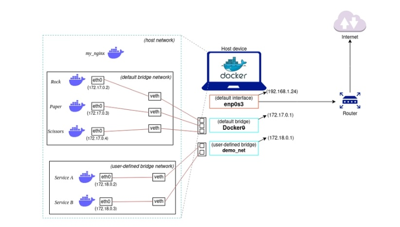

# Docker Networking
* Container networking refers to the ability for containers to connect to and communicate with each other. There are different types of networking.
1) None
2) Bridge (default)
3) Bridge (user defined)
4) Host.

* To list the network 
```
docker network ls
```
```
NETWORK ID     NAME       DRIVER    SCOPE
b3b2b47ad7d5   bridge     bridge    local
abe85f5d3a28   host       host      local
7cca31a313db   none       null      local
```
## None Network

* None is a docker network-type where the container is not attached to any network. As a result, the container is unable to communicate with any external network or other containers. It is isolated from every other network.
* You can run an nginx container in a "none" network type using the following command:
```
docker run -d --network none --name my_nginx nginx
```
```
docker inspect <container_id>
```
```
 "MacAddress": "",
            "Networks": {
                "none": {
                    "IPAMConfig": null,
                    "Links": null,
```

## Bridge Network


* The bridge network mode sets up an internal private network within the host. This allows communication between containers within such network, but isolates them from the host's network.
* When docker containers are created without specifying a network, they are automatically placed in the default bridge network.
* Running a container in default bridge network
```
docker run -d --name nginx_server nginx
```
* Inspect the container to check the bridge
```
docker inspect <container_id>
```
```
"Networks": {
                "bridge": {
                    "IPAMConfig": null,
                    "Links": null,
```
* In default bridge network, container can communicate using only IP address. It won't be able to communicate using the name of the container. IP address of the containers are not same all the time, it may change whenever the container restarts.

* Below are the containers created in default bridge network.
```
[root@ip-172-31-28-221 ~]# docker ps
CONTAINER ID   IMAGE      COMMAND                  CREATED         STATUS         PORTS                                   NAMES
64a97d5dc3a0   nginx      "/docker-entrypoint.…"   5 minutes ago   Up 5 minutes   80/tcp                                  nginx_server
e4345a0375ff   entry:v1   "nginx -g 'daemon of…"   36 hours ago    Up 36 hours    0.0.0.0:8080->80/tcp, :::8080->80/tcp   amazing_elbakyan
```
* Let's try login and ping each other with IPaddress and container name.
```
docker exec -it nginx_server bash
```
```
root@64a97d5dc3a0:/# ping -c2 172.17.0.2
PING 172.17.0.2 (172.17.0.2) 56(84) bytes of data.
64 bytes from 172.17.0.2: icmp_seq=1 ttl=127 time=0.046 ms
64 bytes from 172.17.0.2: icmp_seq=2 ttl=127 time=0.053 ms

--- 172.17.0.2 ping statistics ---
2 packets transmitted, 2 received, 0% packet loss, time 1075ms
rtt min/avg/max/mdev = 0.046/0.049/0.053/0.003 ms
root@64a97d5dc3a0:/# ping amazing_elbakyan
ping: amazing_elbakyan: Name or service not known
root@64a97d5dc3a0:/#
```
* To overcome this we can use user defined bridge network.

## User defined bridge networking


* This network type is also similar to the bridge network. This will also create an private internal network within the host. You can see it by running "ifconfig" on the server.
* It won't come with the docker, you have to create by yourself.
```
docker network create -d bridge demo_network
```
* -d specifies the driver.
* check it's created or not.
```
docker network ls
```
```
NETWORK ID     NAME           DRIVER    SCOPE
8bd9d315c52f   bridge         bridge    local
e598209412cd   demo_network   bridge    local
0863b2ac2efb   host           host      local
192e040a52c3   none           null      local
```
```
[root@ip-172-31-28-221 ~]# docker run -d --network=demo_network --name service_A nginx
e328722859a5eaaa50562817db587f34802be2b6aa4a8ecc5ca8776d15db4e20
[root@ip-172-31-28-221 ~]# docker run -d --network=demo_network --name service_B nginx
4b23fb88db80165257f1908247b29a063e0d0bba8dd26c895b647bec240d4e39
```
* service_A and service_B containers are now attached to the 'demo_net' network
```
[root@ip-172-31-28-221 ~]# docker ps
CONTAINER ID   IMAGE     COMMAND                  CREATED          STATUS          PORTS     NAMES
4b23fb88db80   nginx     "/docker-entrypoint.…"   5 seconds ago    Up 4 seconds    80/tcp    service_B
e328722859a5   nginx     "/docker-entrypoint.…"   16 seconds ago   Up 15 seconds   80/tcp    service_A
[root@ip-172-31-28-221 ~]#
```
* Login to one container and ping another container using container name. It will work.
```
root@4b23fb88db80:/# ping -c2 service_A
PING service_A (172.18.0.2) 56(84) bytes of data.
64 bytes from service_A.demo_network (172.18.0.2): icmp_seq=1 ttl=127 time=0.039 ms
64 bytes from service_A.demo_network (172.18.0.2): icmp_seq=2 ttl=127 time=0.061 ms

--- service_A ping statistics ---
2 packets transmitted, 2 received, 0% packet loss, time 1023ms
rtt min/avg/max/mdev = 0.039/0.050/0.061/0.011 ms
root@4b23fb88db80:/#

```

## HOST Networking


* This Mode of network allows containers to share the host system's network stack, providing direct access to the host system's network.
* To attach the host network to the docker container
```
docker run -d --network=host --name service_C nginx
```
* If you create a container in host network, the container will use the same IP and network configuration as the host.
**when you use host network the container is less isolated from the host system, and has access to all host's network resources. So, this can be a security risk, use host network with caution**


