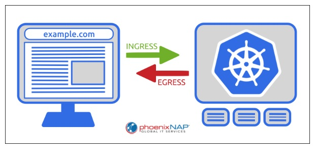

**What is an Ingress in Kubernetes**

Kubernetes Ingress is a resource that defines the external traffic routing rules for the cluster. It is a Kubernetes API object that manages external access to services by specifying the host, path, and other necessary information.
It acts as a Layer 7 (Application Layer) routing mechanism that:
1) Routes traffic to different services based on hostnames (e.g., api.example.com,amazon.com) or paths (e.g., /app1, /app2).
2) Can terminate SSL/TLS, so you don’t have to manage certificates in each service.
3) Supports rewriting URLs, load balancing, and more.

**Ingress vs Egress**

Kubernetes network policy allows administrators to manage and create a separate set of rules for the incoming and outgoing pod traffic. Ingress and Egress are used to differentiate between the two traffic directions:

1) Ingress routes external traffic into the cluster.
2) Egress controls the traffic leaving the cluster. The egress traffic is usually initiated by a cluster service or a pod and forwarded to an external destination using predefined rules.

   

**What is Kubernetes Ingress Controller?**

A Kubernetes Ingress controller is an Ingress API implementation that performs load balancing and reverse proxy functions in the Kubernetes cluster. The controller interprets and implements the rules in the Ingress resource specification.

The Ingress controller object is similar to other Kubernetes controllers, such as Deployments, ReplicaSets, and StatefulSets. It tracks resources in the cluster and ensures that the state of the resources matches the desired state defined by the user.

More than one ingress controller can run inside a single cluster.

**How Does Kubernetes Ingress Work?**

Exposing cluster services externally using Kubernetes Ingress is a multi-step process. The following section explains the mechanism behind Ingress and lists the usual steps necessary to expose a service.
1) **Creating an Ingress resource:** The user creates an Ingress resource and provides configuration details. The necessary information includes host names, paths, and the services that need external access.
2) **Deploying an Ingress controller:** The user creates and applies an Ingress controller. Once operational, the controller monitors the API server and reacts to changes in ingress specification by updating routing rules and reconfiguring the system.
3)  **Proxying and load balancing.** The ingress controller is the point of contact for an external request coming into the cluster. The traffic is routed toward the controller using a load balancer or a DNS entry that connects to the controller's IP address. Once the connection is live, the ingress controller takes the proxy and load-balancing role.
4) **Routing.** The controller analyzes incoming requests, collects host name, path, and header attributes, and determines the service to forward to based on the Ingress resource rules.
5) **SSL/TLS Termination.** Optionally, the Ingress controller can perform SSL/TLS certificate encryption and decryption.
6)  **Communicating with the service.** When the controller determines which service was requested by the client, it proxies the request and allows the service to handle it.

**How is it beneficial compared to Kubernetes LoadBalancer?**

1) Cost: 
   LoadBalancer: Each Service of type LoadBalancer creates an LB, which means more Cost.
   IngressController: One Ingress Controller can handle multiple apps, using one load balancer.
2) Layer:
   LoadBalancer: It provides L4(TCP/UDP) support. It doesn’t understand HTTP or URLs, just forwards packets to the right IP:Port.
   IngressController: It provides L7(https/https) support. It understands URLs, headers, cookies, hostnames, and can apply routing rules.
3) Routing:
   LoadBalancer: No path-based routing, each service needs its own LB
   IngressController: Path-based & host-based routing supported
4) SSL:
   LoadBalancer: Managed at each service level.
   IngressController: Centralized SSL/TLS termination.

## Note

Kubernetes will automatically create the classic loadbalancer. Classic loadbalancer is legacy load balancer. 

Application loadbalancer have many advantages than Classic Load Balancer. It is highly intelligent & multiple routing mechanisms.

hostpath --> amazon.com,flikart.com

pathbased --> amazon.com/books, flipkart.com/payment.

