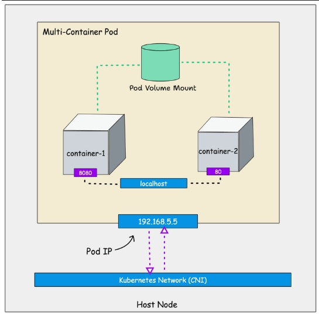
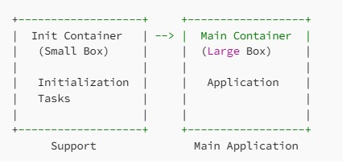
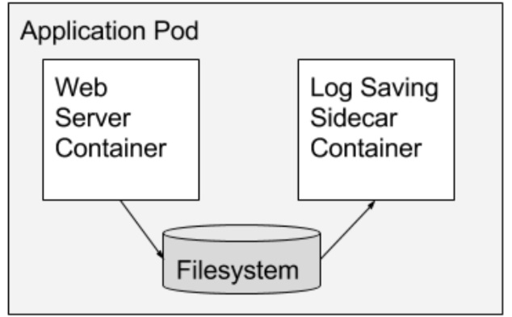

* Pods are the smallest deployable units that you can create and manage in kubernetes.
* A pod represents the single instance of running process in your cluster.
* A pod is group of one or more containers, with shared storage and network resources. All containers within a pod will share the same storage and network.
* Pods are ephermal in nature, they can be created, deleted and updated.

* Each pod gets the unique Ipaddress.
* Containers inside pod connect using local host network on different ports.
* Containers running inside a pod should have different port numbers to avoid port clashes.
* Containers inside a pod share the same volume mount.
* All the containers inside a pod are scheduled on the same node; It cannot span multiple nodes.
* create the pod using the manifest file
  ```
  kubectl apply -f pod.yaml
  ```
                  **OR**
  ```
  kubectl create -f pod.yml
  ```
* To check the pod status 
   ```
   kubectl get pods -n namespace
   ```
* Check the status of the pod along with labels
  ```
  kubectl get pods --show-labels
  ```
* Check the status of the pod including node name and IP addresses
  ```
  kubectl get pods -o wide
  ```
* To delete the pod, there are 2 ways
  ```
  kubectl delete pod -f pod.yaml
  ```
  ```
  kubectl delete pod <pod-name> -n <namespace>
  ```

* Multiple containers are used in case of 
   1) Side car containers
   2) Init containers
## Init containers
* Init Containers are special containers that run before the main application containers in a pod start.
* They are designed to perform initialization tasks, such as setting up configuration files, initializing databases, or any other operation necessary for the proper functioning of the application.

## UseCases
* Configuration setup
   1) Initializing a configuration file before the main application starts, ensuring it has the required settings.
* Database Initialization
   1) Running a database schema initialization script to prepare the database before the main application connects.
* Each init container runs one after the other and must finish successfully before the main containers begin.
## Sidecar containers
* A sidecar container runs alongside your main application container in the same pod and extends its functionality without changing the application code.

* Sidecar Containers run concurrently with the primary container, allowing for parallel execution of tasks.
## use cases
* Logging and monitoring
  1)  A logging sidecar container collecting and forwarding logs to a centralized logging system.
* security operations
  1) A sidecar container handling encryption/decryption tasks to secure communication for the main application.