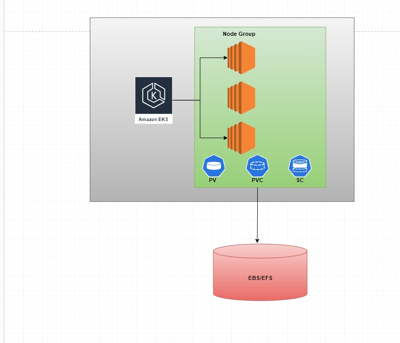

## Why volumes and storage are important in Kubernetes?
* In kubernetes, pods are ephermal in nature, anytime it may be deleted. If we store data inside the pod that data also will be lost when the pod deleted.
* In docker, we can created docker voulmes on host and we can mount those volumes to the containers to persist the data.
* But in kubernetes, Nodes itself they can be delted and recreated at any time due to scaling.
* That's why we need storage and volumes. Volumes are internal to the cluster, but that storage needs to be outside the cluster and the cluster will have the access to the storage.


## Volumes in kubernetes

We have 2 types of volumes in Kubernetes cluster.These volumes are internal to cluster.
* emptyDir --> ephermal volume inside pod
* hostPath --> ephermal volume inside server
#### emptyDir
* emptyDir is a kubernetes ephermal volume used in sidecar patterns. We will mount the volume to the main container and sidecar container share the same storage. 
* This is the memory inside pod. It is useful when multiple containers inside Pod wants to share same storage.

* For example, we have deployed nginx as the main container and filebeat as the sidecar container. Nginx container will write the logs to the volume created and filebeat container will read logs and send to the elastic search, because both the containers will use the same volume.

* This data will be lost when the pod is deleted.
* Refer to **01-emptydir.yaml** and create the emptyDir volume and mount it to the containers.
* Apply the manifest to create the containers and volumes.
  ```
  kubectl apply -f 01-emptydir.yaml
  ```
* Login to the sidecar container and navigate to /var/log/nginx. you will see the nginx log file which means the container uses the same volume that the main container(nginx) using.
  ```
  kubectl exec -it <pod_name> -c <cont_name> -- bash
  ```
* This volume will be delted when the pod is deleted.

#### hostPath

* Like pods our servers will also writes lots of logs, those logs also needs to be analyzed and pushed to the elastic search/centralised logging area.When we want to ship our host logs to elasticsearch we can use this.
* We use hostPath to push the server logs. This is the memory location on the underlying host.
* This is useful in daemonset(creates pod on everynode). Daemonset will access logs through the hostpath.
* Pods can get access to underlying server storage path through hostPath.
* We should not use hostPath in application containers that can lead to security risks. Only use case is to ship host logs that should be in kube-system namespace.

* Refer to the hostpath.yaml and observer how hostPath is configured and apply the manifest.
  ```
  kubectl apply -f hostpath.yaml
  ```
* Login to the container and check you will see all the directories inside /var/log in the pod as well.
  ```
  kubectl exec -it <pod_name> -- bash
  ```

## Storage in Kubernetes

We have 2 different types of storage in Kubernetes
* Static storage
* Dynamic storage
Storage Objects
* PV - persistent volume
* PVC - persistent volume claim
* sc - Storage class
  

PV (Persistent volume):
* PV is the physical representation of the underlying storage.  PV completely reflects the physical storage like memory, access options, reclaim policy, etc. PV is a cluster level resource.
* We will create a EBS/EFS disk outside cluster and we will create a equivalent PV object inside cluster to represent EBS/EFS disk.

PVC(persistenct volume claim):
* PVC is a claim that comes from Pod. 
* It's a resource that represents a user's demand for storage with specific properties, such as size, access mode (e.g., ReadWriteOnce, ReadOnlyMany), and a storage class. PVCs are used to consume storage from PVs.
AccessModes:
* ReadWriteOnce -> the volume can be mounted as read-write by a single node.ReadWriteOnce access mode still can allow multiple pods to access (read from or write to) that volume when the pods are running on the same node.
* ReadOnlyMany --> the volume can be mounted as read-only by many nodes.
* ReadWriteMany --> the volume can be mounted as read-write by many nodes.

SC (Storage Classes)
* When a PVC does not specify a storageClassName, the default StorageClass is used.
* SC is used to dynamically create underlying storage, PV. SC uses the drivers to create external storage, it creates PV implicitly.
* StorageClass may specify the provisioner as "kubernetes.io/aws-ebs" for dynamically provisioning EBS volumes on AWS. When a PVC requests storage from a StorageClass, Kubernetes will use the provisioner specified in the StorageClass to dynamically create and bind a PV that matches the PVC requirements.
* NOTE: Storage class uses drivers to create storage.

Kubernetes foundation created CSI (Container Storage Interface). Earlier we were able to interact with EBS directly. But it is deprecated now, we should install CSI drivers.

EBS CSI
```
kubectl apply -k "github.com/kubernetes-sigs/aws-ebs-csi-driver/deploy/kubernetes/overlays/stable/?ref=release-1.48"
```

EFS CSI
```
kubectl kustomize \
    "github.com/kubernetes-sigs/aws-efs-csi-driver/deploy/kubernetes/overlays/stable/?ref=release-1.5" > public-ecr-driver.yaml
```
**Static Provisioning**
1. User should create storage manually. Make sure EC2 instance Role has EC2 Full access or not.
2. Create PV, storage class option should be empty. This is admin activity
3. Create PVC that can claim PV, storage class option should be empty
4. Use PVC in pod definition.

**Dynamic Provisioning**
1. We should have SC created for the storage type. This is admin activity.
2. Instances should have access to EBS/EFS. Check Security groups in case of EFS.
3. User should create PVC that can have storage class.
4. SC in background create PV implicitly.
5. Here storage class will create disk and PV automatically.

**EBS VS EFS**
* EBS is a block storage and EFS is a network storage.
* EBS is like our computer hard disk and EFS is like Google drive.
* EBS cannot scale automatically, EFS can scale automatically.
* EBS volumes are typically attached to a single EC2 instance at a time. Where EFS file systems can be accessed by multiple EC2 instances concurrently, making it ideal for shared storage needs.
  


