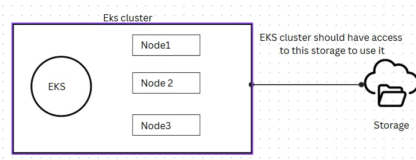

## Why volumes and storage are important in Kubernetes?
* In kubernetes, pods are ephermal in nature, anytime it may be deleted. If we store data inside the pod that data also will be lost when the pod deleted.
* In docker, we can created docker voulmes on host and we can mount those volumes to the containers to persist the data.
* But in kubernetes, Nodes itself they can be delted and recreated at any time due to scaling.
* That's why we need storage and volumes. Volumes are internal to the cluster, but that storage needs to be outside the cluster and the cluster will have the access to the storage.



## Volumes in kubernetes

We have 2 types of volumes in Kubernetes cluster.These volumes are internal to cluster.
* emptyDir --> ephermal volume inside pod
* hostPath --> ephermal volume inside server
#### emptyDir
* emptyDir is a kubernetes ephermal volume used in sidecar patterns. We will mount the volume to the main container and sidecar container share the same storage. 
* This is the memory inside pod. It is useful when multiple containers inside Pod wants to share same storage.

* For example, we have deployed nginx as the main container and filebeat as the sidecar container. Nginx container will write the logs to the volume created and filebeat container will read logs and send to the elastic search, because both the containers will use the same volume.

* This data will be lost when the pod is deleted.
* Refer to **01-emptydir.yaml** and create the emptyDir volume and mount it to the containers.
* Apply the manifest to create the containers and volumes.
  ```
  kubectl apply -f 01-emptydir.yaml
  ```
* Login to the sidecar container and navigate to /var/log/nginx. you will see the nginx log file which means the container uses the same volume that the main container(nginx) using.
```
kubectl exec -it <pod_name> -c <cont_name> -- bash
```
* This volume will be delted when the pod is deleted.
