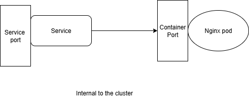

* Service is a method for exposing a network application that is running as one or more pods in your cluster.
* Since Pods are ephemeral and can be recreated at any time (changing their IP addresses), Services provide a stable network endpoint (a virtual IP and DNS name) to access these Pods consistently.

## Why Services are Needed?
1) pods in kuberentes are emphermal in nature, they can be created, destroyed, rescheduled and each time they get a new Ip.
2) Applications often need to communicate with other Pods or be accessed externally. Hardcoding Pod IPs is not possible.
3) A Service decouples Pod IP addresses from clients by exposing a stable DNS name and virtual IP (ClusterIP).

## Types of services
### ClusterIp
* Exposes the Service internally within the cluster.
* Assigns a virtual IP address (ClusterIP) that is accessible only inside the cluster.
* Use case: Communication between microservices inside the cluster.
* Example: A backend service accessed by a frontend.



cluster_Ip.yaml
```
apiVersion: v1
kind: Pod
metadata:
  name: sample-pod
  labels:
    environment: dev
    app: frontend
spec:
  containers:
    - image: nginx
      name: sample-nginx
      ports:
        - containerPort: 80
---
apiVersion: v1
kind: Service
metadata:
  name: nginx-service
spec:
  selector:
    environment: dev
    app: frontend
  ports:
    - name: name-of-the-service-port
      protocol: "TCP"
      port: 80 # This port belongs to the service
      targetPort: sample-nginx # This port belongs to the container
```
* Using cluster IP we can't access the application from outside.

## Nodeport

* Exposes the Service on each Node’s IP at a static port (30000–32767).
* Opens a random port between (30000-32767) on all nodes available.
* Cluster IP is the subset of the Nodeport, It will automatically create the Cluster IP in the background.

