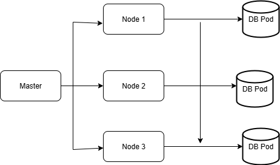

* StatefulSet in kubernetes is used to manage stateful applications. Statfeul application such as MySQL, Redis and MOngoDB etc.,
 
* A request is coming to node1 to create a user in DB . This node will send the request to other nodes to update in their DB .This is how DB related application works, all DB needs to be in sync. In this scenario stateful sets are useful.
* Statefulset will create pods in ordely manner, If you order 3 pods it will create like 
nginx 0 is success then create nginx1 and nginx 1 is success then create nginx2.
nginx 0 is success then create nginx1 and nginx 1 is succes 
* Statefulset preserve the network identity of the pod. Pods get a DNS hostname based on their name and StatefulSet.
  ```
  nginx-0.nginx.default.svc.cluster.local
  ```
* Statefulset keeps the pod identity same for communication. Even though you restart the pod, the name won't change.
* Deployment will use service, but for stateful set it is mandatory to use headless service.

To understand the behaviour of headless service, follow the below steps:
* Create a deployment and attach a service to it.
* Login to the deployment pod and do nslookup for service. You will get the IPaddress of the service.
* Follow the same steps for statefulset, but for statefulset if you do nslookup you will get the IP addresses of all the pods.
For headless service, the configuration be like below
```
spec:
  clusterIP: None
```
## In Statefulset, how the Node1 understands, how many nodes are available?
* It will do the nslookup of the service, then it will show the all the pod IP's available and sends a request to update the details.

**In deployment "nslookup service_name" will give you the IP address of the service**

**In Statefulset "nslookup sevice_name" will give you the IP addresses of all the pods**