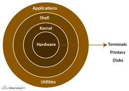

# Introduction to Linux
Linux is a powerful, open-source Unix-like operating system kernel first developed by Linus 
Torvalds in 1991.
## Characteristics
 * Multitasking
 * Multi-user support
 * Portability across architectures (x86, ARM, RISC-V, etc.)
 * Security via permission models, namespaces, cgroups
 * Stability and Uptime (often runs for years without reboot

Everything is a File: Devices, sockets, pipes, configs — all treated as files

## Distribution
A distribution = Linux Kernel + Package Manager + Default Utilities + Desktop/CLI + System 
Configs
* General use - Ubuntu, Debian, Fedora
* Enterprise - RHEL, SUSE, Oracle Linux
* Cloud/server - Ubuntu server, Amazon Linux, Centos stream

##  Real-World Applications of Linux

 * Cloud Platforms: AWS, Azure, GCP all use Linux underneath
 * Web Servers: Apache, NGINX, HAProxy, Node.js — all commonly run on Linux
 * DevOps Tools: Docker, Kubernetes, Jenkins, GitLab — all built for Linux first
 * AI/ML/Dev Environments: TensorFlow, PyTorch — commonly deployed 
   on Ubuntu/Debian
 * Gaming: Steam Deck uses Arch Linux; Proton enables Windows game compatibility

## Architecture of Linux
The Linux architecture is a layered structure comprising the hardware, kernel, shell, Utilities and applications.

### Kernel
* Kernel is the main core component it is lies between the shell and the hardware.
* It manages communication between the hardware and the system.
* The kernel is responsible for:
     * Memory management: Manages and allocates memory efficiently.
     * Resource allocation: Distributes system resources to different processes.
     * Device management: Controls input/output devices like printers and scanners.
     * Process management: Manages process execution and scheduling.
     * Application interaction: Bridges applications with system-level functions.
     * Security: Provides essential system-level security.

### shell
Shell acts as the interface to the kernel. It takes commands from the user and interprets them. The shell transmits these commands to the kernel, which then performs the requested operations. Users can just enter the commend and using the kernel's function that specific task is performed accordingly.

### Hardware layer
Hardware layer of Linux is the lowest level of operating system. It is plays a vital role in managing all the hardware components. It includes device drivers, kernel functions, memory management, CPU control, and I/O operations. This layer generalizes hard complexity, by providing an interface for software by assuring proper functionality of all the components.

## Boot Process in Linux
The Linux boot process involves the following sequence:
   1) **BIOS/UEFI**: Power-On Self Test (POST), locates bootloader
   2) **Bootloader** (e.g., GRUB, LILO): Loads the kernel image (vmlinuz)
   3) **Kernel Initialization**: Mounts root filesystem, starts PID 1
   4) **Init System** (systemd, SysVinit, upstart):
          * Mounts additional partitions
          * Initializes services (systemctl start nginx)
          * Brings system to a target (multi-user, graphical)
    **Key Files Involved**
       * /boot/vmlinuz-* → Kernel binary
       * /boot/initrd.img → Init RAM disk
       * /etc/fstab → Filesystem mount instructions
       * /etc/systemd/system/*.service → Services configurations
    

