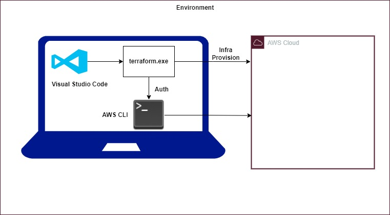

Before the advent of the IAC, infrastructure management was really manual and time consuming process. System administration and operations teams had to do
  1) Manually configure server
  2) Lack of version control for infrastructure configuration
  3) Documentation heavy --> becomes outdated quickly
  4) Limited automation
  5) slow provisioning
IaC addresses these challenges by providing a systematic, automated and code driven approach to infrastructure management.
Terrafom is the one of the popular IAC tool. 

### why Terraform?

There are multiple reasons why terraform is used over another tools.
* **Declarative syntax** <br />
    Terraform uses the declarative syntax, allowing you to specify the desired end state of your infrastructure.
* **Version Control** <br />
    Since it is a code, we can maintain it in Git for version control. So that we can maintain the history of infra and collaboration is easy.
* **Consistent Infra** <br />
    Often we face the problem of different configurations in different environments like DEV, QA, PROD, etc. Using terraform we can create similar infra in multiple environments with more reliability.
* **Automated Infra CRUD:** <br />
    Using terraform we can create entire infra in minutes.
    Updating infra using terraform is easy.
    Using terraform we can delete infra so we can't miss any resources to delete.
* **inventory management:** <br />
    If we create infra manually it is very tough to maintain the inventory of resources in diff region. But by seeing terraform you can easily tell the resources you are using in different regions for particular project.
* **cost optimization:** <br />
    When you need infra you can create in minutes. When you don't you can delete in minutes, so you can save the cost.
* **Dependency management:** <br />
    terraform can understand the dependency of resources. It can tell us the dependency clearly.
* **Modular approach:** <br />
    Code reuse. We can develop our own modules or use open source modules to reuse the infra code. instead of spending more time to create infra from the scratch we can reuse modules.

## Terraform environment setup on windows

Below is the environment setup.

**Softwares Required:**

* VS Code
* Terraform
* AWS account
* AWS CLI V2



**steps:**

* Install terraform from below url
  ```
  https://developer.hashicorp.com/terraform/install
  ```
* Edit the system environment variables and add the path to terraform.
* Install AWS CLI in your machine.
* Create an IAM admin user and create access key and secret key for the user.
* Configure the aws cli with the user by providing access key and secret key.
  ```
  aws configure
  ```


#### Terraform Commands

* First command is to initialize the terraform, at this stage terraform downloads the provider into .terraform folder.

```
terraform init
```

* Next we need to run plan command, at this stage terraform compares the infra between declared and existing. This is only plan terraform will not create

```
terraform plan
```

* Next we need to apply the infra, at this stage terraform create the infra with approval.

```
terraform apply
```


  